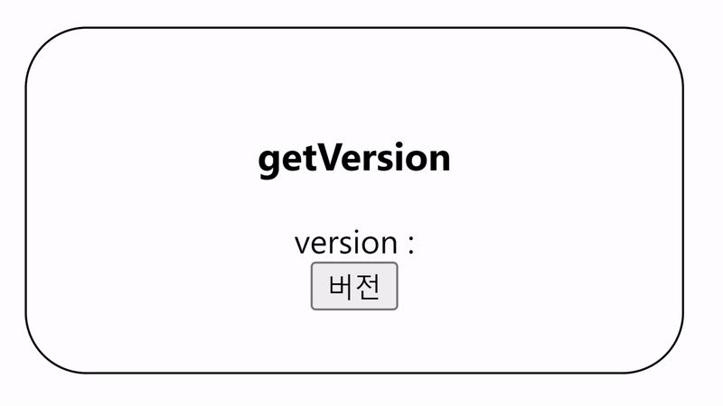
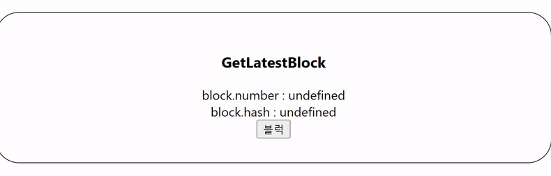
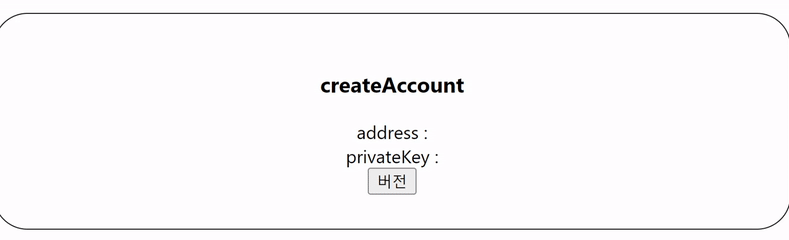
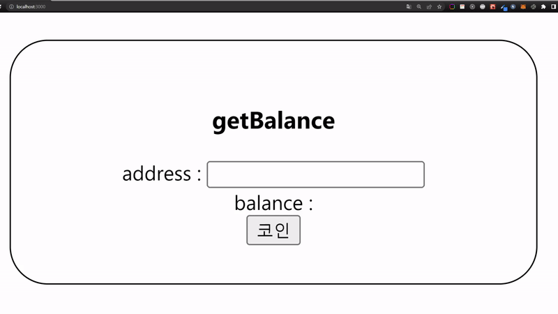
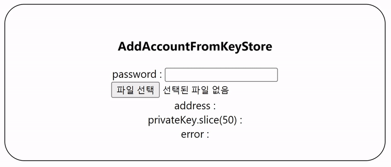
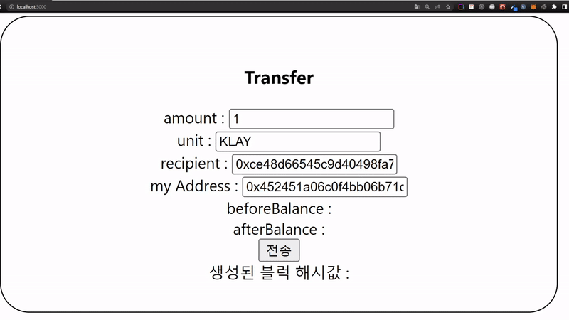

# KAS 기반으로 클레이튼 서버를 개발 with React

## 개요
클레이튼 서버 와 이를 테스트할 간단한 react 페이지로 구성했다.

## 기술스택
- ## Client
  -  react
  -  axios
- ## Server
  - express
  - mutler
  - caver-js

## caver-js
caver-js는 HTTP or 웹소켓 연결로 Klaytn 노드와 상호작용할 수 있도록 하는 자바스크립트 API 라이브러리이다.

## multer
keyStore 파일을 클라이언트에서 서버로 전송해야해서 formData를 사용했다.
multer는 파일 업로드에 사용되는 node.js middleware 이다.
해당부분은 아래서 자세히 설명하겠다.

[전체코드](./server/routes/index.js)

## 코드 설명
```javascript
...
// getVersion (client Version확인)
const version = await caver.rpc.klay.getClientVersion();
...

...
// getLatestBlock (마지막 블럭 데이터 확인)
const block = await caver.rpc.klay.getBlockByNumber("latest");
...

...
// 새로운(랜덤) keyring 만들기
const keyring = caver.wallet.keyring.generate()
// wallet에 추가
caver.wallet.add(keyring)
...

...
// json 형태의 keystore파일과 password를 입력해 keyring을 생성할수있다.
const keyring = await caver.wallet.keyring.decrypt(keystore, password);
...

...
// wallet에서 주소에 일치하는 keyring을 반환한다.
const keyring = await caver.wallet.getKeyring(address)
...

...
// 지갑주소에 금액 가져오기
const balance = await caver.klay.getBalance(address);
...
```

## transaction
**transaction은 생성 후 서명과 전송과정을 거친다.**
```javascript
...
// 상대 지갑에 클레이튼 전송

// transaction 생성
const transaction = await caver.transaction.valueTransfer.create({
      type: 'VALUE_TRANSFER', 
      from: "보내는 지갑 주소",
      to: "받는 지갑 주소",
      value: caver.utils.toPeb(1, unit), // unit 은 단위를 말한다 ex) "KLAY"
      gas: 25000,
    })

// transaction 서명
const signed = await caver.wallet.sign(address, transaction)

// transaction 전송
const receipt = await caver.rpc.klay.sendRawTransaction(signed)
res.json(receipt);
...
```

클라이언트 주소는 http://localhost:3000 서버 주소는 http://localhost:4000 이다.

client package.json에 proxy설정을 해두었다.

덕분에 client에서 따로 axios uri 설정 없이 데이터를 가져올 수 있었다.

그 중에 react로 formData를 사용해본적이 없어 해당 부분만 보겠다.

## multipart/form-data 

json파일을 업로드하는 방법으로 multipart/form-data을 선택했다.

먼저 **`<form>`** 태그를 작성한다.
```javascript
<form>
    <label htmlFor="profile-upload" />
    <input type="file" id="profile-upload" accept="application/json" onChange={onChangeFileHandler} />
</form>
```

사용자가 파일을 선택했을 경우 작동하는 onChange handler이다.
```javascript
const onChangeFileHandler = async (e) => {
        e.preventDefault();
        if (e.target.files) {
            const uploadFile = e.target.files[0]
            const formData = new FormData()
            formData.append('keyStore', uploadFile)
            formData.append('password', password)
            ...생략...           
        }
    }
```

서버 부분에서는 multer라는 라이브러리를 사용했다.

{
  fieldname: 'keyStore',
  originalname: 'kaikas-0x452451a06c0f4bb06b71da859a49980bfdcaf718.json',
  encoding: '7bit',
  mimetype: 'application/json',
  destination: 'uploads/',
  filename: '5f4d316d0a252ab0de23303f1c2362ee',
  path: 'uploads\\5f4d316d0a252ab0de23303f1c2362ee',
  size: 491
}
```javascript
// dest는 파일이 저장될 경로
const upload = multer({ dest: 'uploads/' })
...
router.post('/addAccountFromKeyStore', upload.single('keyStore'), async (req, res, next) => {
  try {
    // req.file에 아래에 아래와 같은 형식으로 저장되어있다.
    // {
    //   fieldname: 'keyStore',
    //   originalname: 'kaikas.json',
    //   encoding: '7bit',
    //   mimetype: 'application/json',
    //   destination: 'uploads/',
    //   filename: '5f4d316d0a252ab0de23303f1c2362ee',
    //   path: 'uploads\\5f4d316d0a252ab0de23303f1c2362ee',
    //   size: 491
    // }
    // 가져올때는 해당 파일 이름으로 fs를 사용해서 가져왔다.
    const { file: { filename = "" } = {} } = req;
    const keystore = fs.readFileSync(`uploads/${filename}`, 'utf8');
    ...
  }
  catch (error) {
    ...
  }
});

```


## /getVersion


## /getLatestBlock


## /createAccount


## /getBalance


## /addAccountFromKeyStore


## /transfer



마치며

[공식문서](https://ko.docs.klaytn.com/dapp/sdk/caver-js)

공식문서에 caver에 대해 잘 나와있어서 이번 프로젝트는 편했다.

caver-js 다음에 나온 `caver-js-ext-kas`라이브러리가 있었는데.

[www.klaytnapi.com](www.klaytnapi.com) 에서 Access Key를 받아 클레이트 노드와 통신하는 방식이였다.

보안적인면에서 직접 만든 서버에서 관리하기 보다는 클레이튼쪽에서 직접 관리해주는게 더 좋다는 생각이 들었다.

만드는 방식이 크게 차이가 나지 않아 코드 리팩토링때 사용해볼 계획이다.

[수수료 위임](https://ko.docs.klaytn.com/dapp/sdk/caver-js/api-references/caver.transaction/fee-delegation)하여 transaction 하는 부분도 추가적으로 만들 계획이다.
